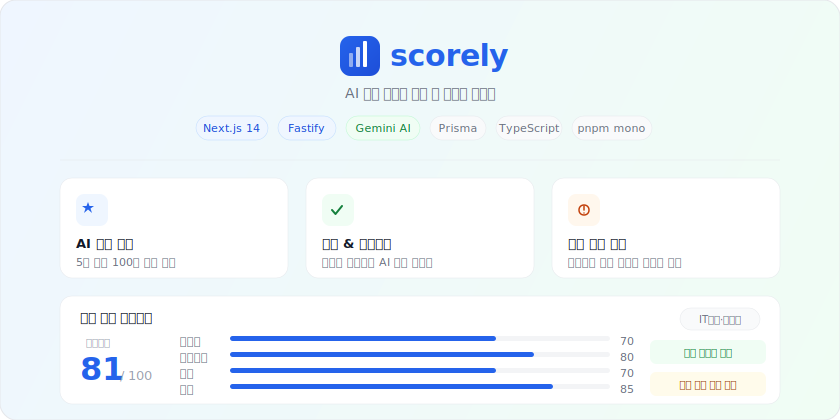

<p align="center">
  
</p>

<p align="center">
  <b>PDF 한 번 업로드로 신입 기준 직군별 점수, AI 피드백, 추천 텍스트까지</b>
</p>

---

## 서비스 개요

**Scorely**는 신입 취준생을 위한 AI 이력서 분석 서비스입니다.
PDF 이력서를 업로드하면 Gemini AI가 13개 직군 기준으로 분석하고,
TipTap 에디터에서 텍스트를 수정하며 재분석받을 수 있습니다.

### 핵심 사용 흐름

```
PDF 업로드 → AI 분석 → 점수 & 피드백 확인 → 에디터에서 수정 → 재분석 → 점수 변화 추적
```

1. **PDF 업로드** - AI가 텍스트를 자동 추출하고 직군별로 분석
2. **5개 항목 점수 확인** - 전문성, 실무경험, 성과, 협업, 구성
3. **강점/개선사항 피드백** - 구체적인 개선 방향 제시
4. **AI 추천 텍스트** - 섹션별로 개선안을 참고용으로 제공
5. **에디터에서 수정 → 재분석** - 수정 후 점수 변화를 버전별로 추적

---

## 주요 기능

| 기능 | 설명 |
|------|------|
| AI 종합 분석 | 5개 항목(전문성·실무경험·성과·협업·구성) 100점 만점 분석 |
| 직군별 평가 | 13개 직군 기준별 맞춤 분석 (IT개발, 디자인, 마케팅 등) |
| 섹션별 AI 추천 | 소개, 경험, 프로젝트 등 섹션별 텍스트 개선안 제공 |
| 실시간 에디터 | TipTap 에디터에서 직접 수정 + 500ms 디바운스 자동 저장 |
| 재분석 & 버전 관리 | 수정 후 재분석하면 새 버전으로 저장, 점수 변화 차트 제공 |
| 감점 항목 분석 | 이력서의 구체적 감점 사유와 감점 점수 표시 |

---

## 기술 스택

| 영역 | 기술 |
|------|------|
| **백엔드** | Node.js + Fastify + TypeScript + Prisma + PostgreSQL |
| **프론트엔드** | Next.js 14 (App Router) + TypeScript + Tailwind CSS |
| **AI** | Google Gemini 2.5 Flash (`@google/genai`) |
| **파일 저장** | AWS S3 (`@aws-sdk/client-s3`) |
| **인증** | JWT + bcryptjs |
| **에디터** | TipTap (`@tiptap/react` + `@tiptap/starter-kit`) |
| **차트** | Chart.js + react-chartjs-2 (레이더 차트, 점수 추이 라인 차트) |
| **패키지 관리** | pnpm workspace (모노레포) |
| **배포** | Vercel (프론트) + AWS EC2 + PM2 + Nginx (백엔드) + AWS RDS |
| **CI/CD** | GitHub Actions (타입체크, 자동 배포) |

---

## 프로젝트 구조

```
scorely/
├── apps/
│   ├── backend/           # Fastify API 서버
│   │   ├── src/
│   │   │   ├── routes/         # API 라우트
│   │   │   ├── services/       # 비즈니스 로직
│   │   │   │   └── gemini/     # AI 분석 (프롬프트, 파싱, 직군별 가이드)
│   │   │   ├── repositories/   # DB 접근 계층
│   │   │   ├── middlewares/     # 인증, 에러 핸들러
│   │   │   └── config/         # 환경변수, Prisma
│   │   └── prisma/             # 스키마, 마이그레이션
│   └── frontend/          # Next.js 14 웹 앱
│       └── src/
│           ├── app/            # 페이지 (랜딩, 로그인, 업로드, 분석, 히스토리)
│           ├── components/     # UI 컴포넌트 (에디터, 차트, 피드백)
│           ├── hooks/          # 커스텀 훅 (useEditor, useResume)
│           ├── contexts/       # AuthContext
│           └── lib/            # API 클라이언트, 인증 유틸
├── packages/
│   └── types/             # 공유 타입 (@scorely/types)
├── scripts/               # EC2 초기화 스크립트
└── docs/                  # 문서
```

---

## API 엔드포인트

### 인증

| 메서드 | 경로 | 설명 |
|--------|------|------|
| POST | `/api/auth/register` | 회원가입 |
| POST | `/api/auth/login` | 로그인 |
| GET | `/api/auth/me` | 내 정보 조회 |

### 이력서

| 메서드 | 경로 | 설명 |
|--------|------|------|
| POST | `/api/resume/upload` | PDF 업로드 + 최초 AI 분석 |
| GET | `/api/resume/:id` | 특정 버전 상세 조회 |
| GET | `/api/resume/history` | 전체 버전 목록 |
| PATCH | `/api/resume/:id/text` | 에디터 텍스트 자동 저장 |
| PATCH | `/api/resume/:id/sections` | 섹션별 텍스트 저장 |
| POST | `/api/resume/:id/reanalyze` | 재분석 (새 버전 생성) |
| POST | `/api/resume/:id/section-recommend` | 섹션별 AI 추천 텍스트 |
| DELETE | `/api/resume/:id` | 이력서 삭제 |

### 분석

| 메서드 | 경로 | 설명 |
|--------|------|------|
| GET | `/api/analysis/history` | 점수 히스토리 (차트용) |

### 기타

| 메서드 | 경로 | 설명 |
|--------|------|------|
| GET | `/health` | 서버 상태 확인 |
| GET | `/docs` | Swagger UI |

---

## 지원 직군 (13종)

`IT개발·데이터` · `디자인` · `마케팅·광고` · `경영·기획` · `영업·판매` · `회계·세무·재무` · `인사·노무` · `의료·제약` · `금융·보험` · `연구·R&D` · `교육` · `생산·제조` · `기타`

---

## 로컬 실행

### 사전 요건

- Node.js 20+
- pnpm 8+
- PostgreSQL

### 설치 및 실행

```bash
# 의존성 설치
pnpm install

# 환경변수 설정
cp apps/backend/.env.example apps/backend/.env
# DATABASE_URL, JWT_SECRET, AWS_*, GEMINI_API_KEY 입력

echo "NEXT_PUBLIC_API_URL=http://localhost:3000" > apps/frontend/.env.local

# DB 마이그레이션
cd apps/backend && pnpm prisma migrate dev && cd ../..

# 백엔드 + 프론트엔드 동시 실행
pnpm dev

# 백엔드:   http://localhost:3000
# 프론트:   http://localhost:3001
# Swagger:  http://localhost:3000/docs
```

---

## 배포 아키텍처

```
사용자
  │
  ├──▶ Vercel (프론트엔드 / Next.js)
  │
  └──▶ AWS EC2 + Nginx + PM2 (백엔드 / Fastify)
            │
            ├──▶ AWS RDS PostgreSQL
            ├──▶ AWS S3 (PDF 저장)
            └──▶ Google Gemini API
```

| 서비스 | 설정 파일 |
|--------|----------|
| PM2 | `apps/backend/ecosystem.config.js` |
| Nginx | `apps/backend/nginx.conf` |
| EC2 초기화 | `scripts/setup-ec2.sh` |
| CI/CD | `.github/workflows/deploy-backend.yml` |
| 타입체크 | `.github/workflows/typecheck.yml` |
